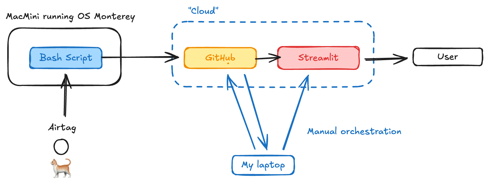

# Garfield Location Tracker

Tracks Garfield's location using Apple's Find My network and visualizes movement history on an interactive map.

## Architecture

## How it works

1. **AirTag** - Attached to Garfield, broadcasts location via Apple's Find My network
2. **MacMini** - Runs a bash script that periodically reads location data from Apple's cache and pushes it to GitHub
3. **GitHub** - Stores location history as the central data repository
4. **Streamlit** - Web app that reads from GitHub and displays Garfield's movement on an interactive map
5. **Manual Orchestration** - Laptop used to manage and coordinate the system components

## Usage
### Set up bash script on MacMini
- Copy the script copy_v2.sh to the desktop of the MacMini
- In terminal, navigate to the desktop and run the following command to add executable permissions: `chmod +x copy_v2.sh`
- Then run the following command to run the script: `./copy_v2.sh`

### Update location
- Pull the latest raw data in GitHub
- Run the python program: `main/processor.py'
- Push the changes to GitHub
  
### Update Streamlit
- Go to Streamlit community, then Reboot the app
